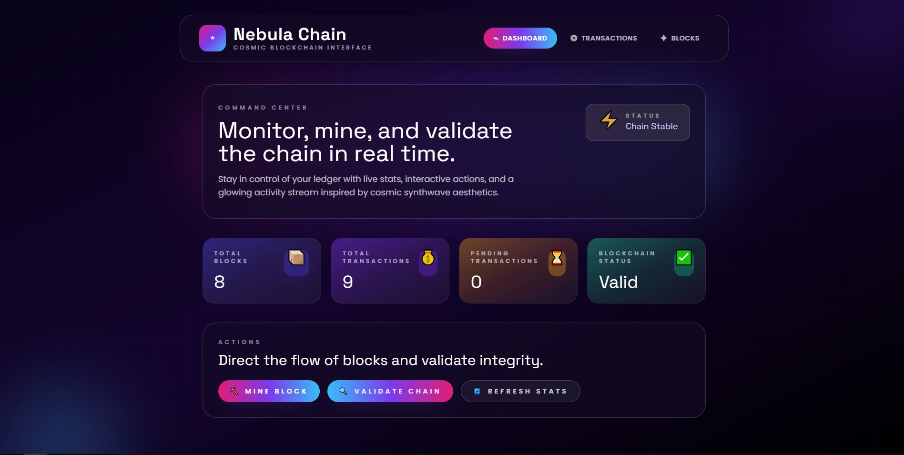
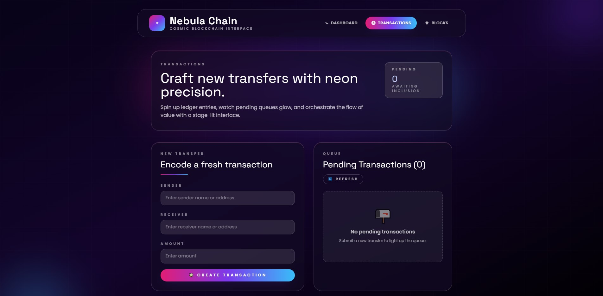
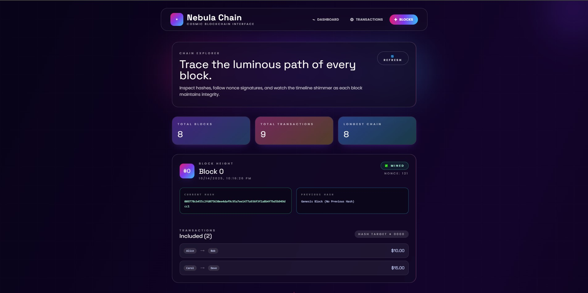
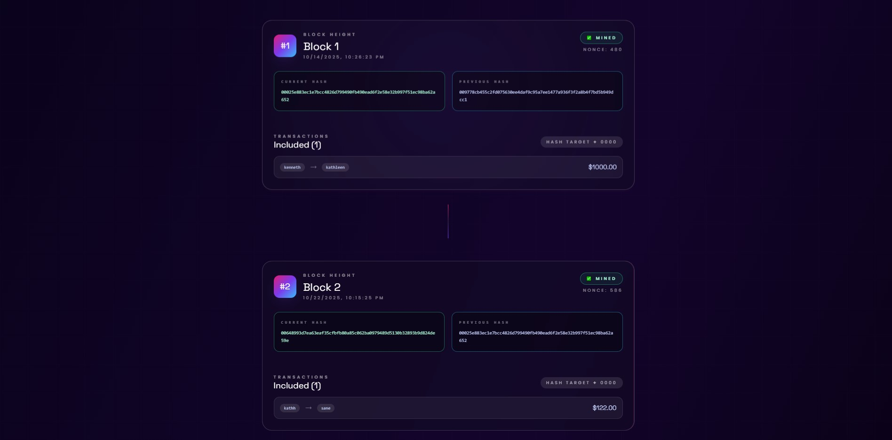

# Nebula Chain – Blockchain Transaction Platform

A full-stack blockchain playground built with Laravel + PostgreSQL + React/Tailwind. Monitor blocks, craft transactions, and validate the chain in real time with a neon-inspired UI recreated in the screenshots below.






---

## ✨ Highlights
- **End-to-end blockchain flow** – queue transactions, mine blocks with proof-of-work, and validate integrity.
- **Cosmic UI kit** – gradient glassmorphism, motion cues, and responsive layouts showcased in the gallery above.
- **Containerized workflow** – one `docker compose up -d` spins up Laravel, React, and PostgreSQL.
- **Typed REST API** – predictable endpoints for mining, stats, and transaction queues.
- **Production-ready structure** – separate entrypoints, `.env` templating, and database volumes.

---

## 🧱 Architecture at a Glance
| Layer | Tech | Notes |
| --- | --- | --- |
| Frontend | React 18 + Tailwind CSS | Animated dashboard/transactions/blocks views, consumes REST API. |
| Backend | Laravel 10 (PHP 8.3) | Handles transaction lifecycles, mining logic, validation, and stats aggregation. |
| Database | PostgreSQL 15 | Persists blocks, transactions, and pivot relationships. |
| Orchestration | Docker Compose | Three services (`react`, `laravel`, `postgres`) wired via shared network. |

---

## 🚀 Quick Start (Docker)
```bash
cd d:/block
docker compose up -d
```

Services booted:
- **Frontend** – http://localhost:3001
- **API** – http://localhost:8001 (REST) / http://localhost:8001/api
- **PostgreSQL** – localhost:5433 (`blockchain_user` / `blockchain_pass`)

Stop everything when finished:
```bash
docker compose down
```

---

## 🧰 First-Time Setup
Install dependencies the first time the containers are created:

```bash
# Laravel dependencies, env, and migrations
docker compose exec laravel bash -lc "composer install && cp -n .env.example .env && php artisan key:generate && php artisan migrate"

# React dependencies
docker compose exec react sh -c "npm install"

# Restart to pick up installs
docker compose restart
```

---

## 📊 Feature Tour
- **Dashboard** – live stats (blocks, transactions, pending queue) plus quick actions for mining and validation.
- **Transactions** – encode a transfer, monitor pending queues, and refresh the list.
- **Blocks Explorer** – show hash metadata, nonces, included transactions, and hash target goals.
- **Mining Engine** – proof-of-work (difficulty 2 leading zeros) with nonce tracking.
- **Chain Validation** – one-click hash/previous-hash comparison to prove integrity.

---

## 🔌 Key API Endpoints
| Method | Endpoint | Description |
| --- | --- | --- |
| POST | `/api/transaction` | Create a new pending transaction. |
| GET | `/api/transactions/pending` | Inspect the queue awaiting inclusion. |
| GET | `/api/transactions` | List every transaction with status. |
| POST | `/api/block/mine` | Mine a block using transactions in the queue. |
| GET | `/api/blocks` | Retrieve the blockchain with embedded transactions. |
| GET | `/api/blockchain/statistics` | Aggregated metrics used by the dashboard. |
| GET | `/api/blockchain/validate` | Returns `{ valid: true/false }` plus details. |

---

## 🛠️ CLI Cheatsheet
```bash
# Tail logs
docker compose logs -f laravel
docker compose logs -f react

# Enter Laravel container for artisan work
docker compose exec laravel bash

# Access PostgreSQL shell
docker compose exec postgres psql -U blockchain_user -d blockchain

# Run artisan helpers
php artisan migrate --force
php artisan route:list

# Build frontend bundle
docker compose exec react npm run build
```

---

## 🧯 Troubleshooting
| Issue | Fix |
| --- | --- |
| Ports 3001/8001/5433 busy | Adjust the mappings in `docker-compose.yml` or free local ports. |
| React shows network errors | Confirm Laravel container is running; `docker compose logs laravel`. |
| Database connection refused | Make sure `postgres` container is healthy; restart the stack. |
| Missing Composer/NPM deps | Re-run the first-time setup commands shown above. |

---

## � Portfolio Usage
Screenshots live under `docs/media/` so recruiters can preview the UI directly on GitHub. Replace the JPGs any time you capture fresh shots, then commit and push.

---

## � Maintainer
**Kenneth Santos**  
Marikina City, NCR – Philippines  
📧 skenneth695@gmail.com  
📱 (+63) 977-238-0113

Built alongside MannyTransfer and other portfolio pieces—happy to connect if you want a walkthrough. 🌌
